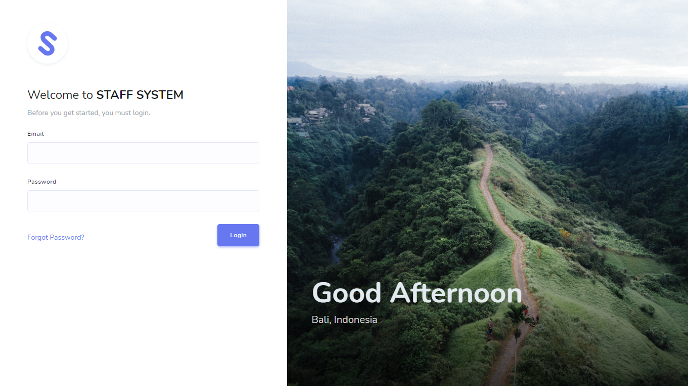
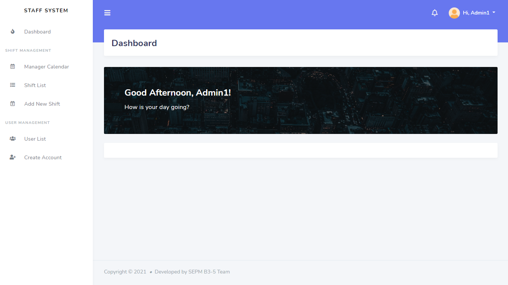

#### SEPM-2021-sem1-B3-5

# Staff System Project
This is Staff System which is a tool for management of working shifts of the staff.
We used [Stisla Admin Template](https://github.com/stisla/stisla) that help us to speed up the project.

Before you start, please import the database (**staff_system_db.sql** under root directory) into your database server. Otherwise it would not work.

## Database Detail
* Host: localhost
* Username: root
* Password: 
* Database Name: staff_system_db

## Default Test Account
* Admin 1
  * Email: admin1@example.com
  * Password: admin1
* Admin 2
  * Email: admin2@example.com
  * Password: admin2
* User 1
  * Email: test1@example.com
  * Password: test1
* User 2
  * Email: test2@example.com
  * Password: test2

## Environment Requirement
* XAMPP 7.3.x (for local developed environment)
  * Download link: https://sourceforge.net/projects/xampp/files/
* Apache 2.4
* PHP 7.3.x (lower than PHP 8)
* Mysql (MariaDB 10.1.37)

